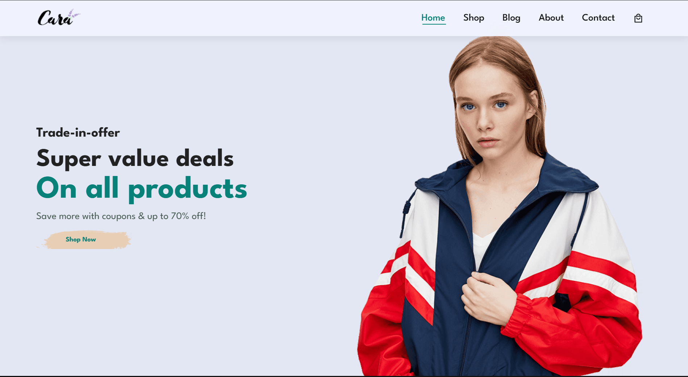
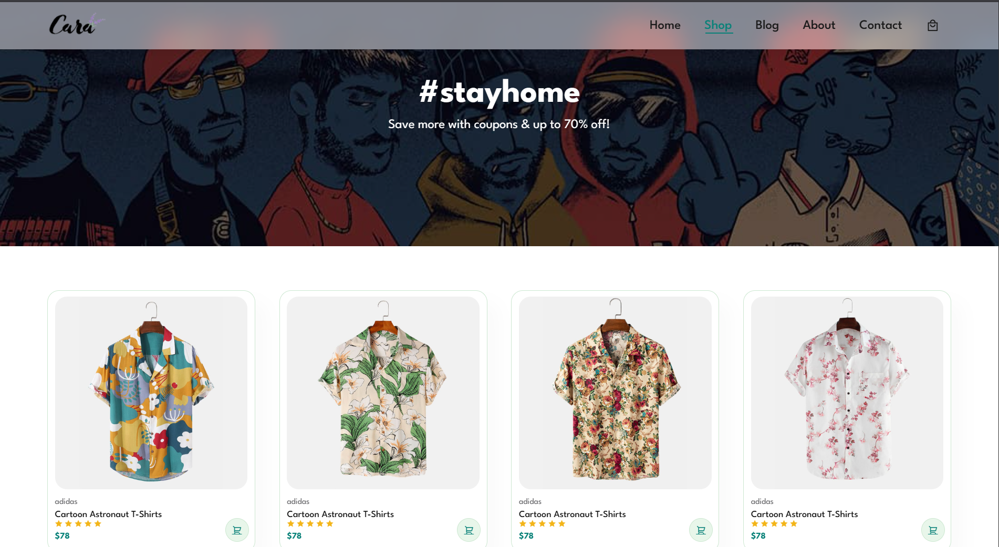
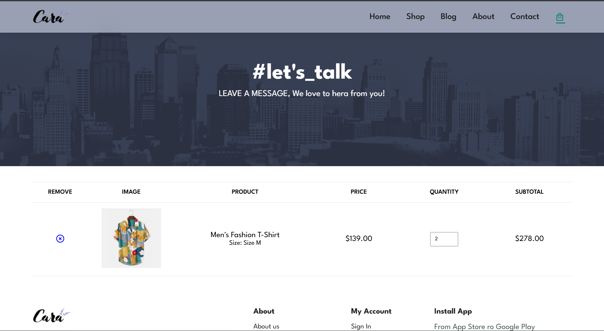

# 🛍️ Sara — Modern E-Commerce Platform

<div align="center">

[](https://opensource.org/licenses/MIT)
[](https://developer.mozilla.org/en-US/docs/Web/HTML)
[](https://developer.mozilla.org/en-US/docs/Web/CSS)
[](https://developer.mozilla.org/en-US/docs/Web/JavaScript)
[](https://fastapi.tiangolo.com/)
[](https://www.postgresql.org/)
[](https://www.docker.com/)
[](https://vitejs.dev/)
[](https://github.com/deepthi-mahendran/Sara/commits/main)

**A full-stack e-commerce platform built by [Deepthi Mahendran](https://github.com/deepthi-mahendran) — vanilla HTML/CSS/JS frontend with 32 real products, 4-column responsive product grid, FastAPI + PostgreSQL backend, and Docker-based deployment.**

[🚀 Live Demo](https://sara-seven-ashen.vercel.app/) · [Report Bug](https://github.com/deepthi-mahendran/Sara/issues) · [Request Feature](https://github.com/deepthi-mahendran/Sara/issues)

</div>


## 📋 Table of Contents

- [About The Project](#-about-the-project)
- [Tech Stack](#-tech-stack)
- [Features](#-features)
- [Getting Started](#-getting-started)
- [Project Structure](#-project-structure)
- [Available Scripts](#-available-scripts)
- [API Endpoints](#-api-endpoints)
- [Testing](#-testing)
- [Screenshots](#-screenshots)
- [Roadmap](#-roadmap)
- [Contributing](#-contributing)
- [License](#-license)
- [Contact](#-contact)
- [Acknowledgments](#-acknowledgments)


## 🎯 About The Project

Sara is a full-stack e-commerce platform that provides users with a complete online shopping experience — from browsing and wishlisting to checkout and order tracking. The frontend is built with semantic HTML5, modern CSS3, and vanilla ES6+ JavaScript modules. The backend is a FastAPI REST API backed by PostgreSQL with features like JWT authentication, AI-powered outfit recommendations, and real-time shared carts via WebSockets.

### Why Sara?

- ✨ **Modern UI** — Clean interface with dark mode support, smooth animations, and responsive 4-column product grids
- 📱 **Fully Responsive** — Optimized for mobile, tablet, and desktop
- ⚡ **Fast & Lightweight** — No heavy frontend framework; vanilla JS bundled with Vite
- 🔒 **Secure** — JWT auth, CSRF protection, rate limiting, Content Security Policy headers
- 🐳 **Containerized** — Full Docker Compose stack (Nginx + FastAPI + PostgreSQL) ready to deploy
- 🧪 **Comprehensive Test Coverage** — 117 test files (988 unit tests) covering frontend modules via Vitest
- 🆓 **Open Source** — MIT licensed, free to use and learn from


## 🛠️ Tech Stack

### Frontend
| Technology | Purpose |
|---|---|
| HTML5 | Semantic page structure |
| CSS3 | Custom styling with Flexbox, Grid, and CSS custom properties |
| JavaScript (ES6+) | Application logic as modular ES modules |
| Vite 8 | Dev server with HMR and production bundling |
| Remix Icon + Font Awesome | Iconography |
| Google Fonts | Typography |

### Backend
| Technology | Purpose |
|---|---|
| FastAPI | REST API framework |
| PostgreSQL 16 | Relational database |
| SQLAlchemy + Alembic | ORM and database migrations |
| Pydantic v2 | Request/response validation |
| python-jose + passlib | JWT authentication and password hashing |
| FAISS + Transformers | AI-powered visual similarity search |
| SlowAPI | Rate limiting |

### Infrastructure
| Technology | Purpose |
|---|---|
| Docker + Docker Compose | Container orchestration |
| Nginx | Reverse proxy, static file serving, API routing |
| Vitest | Frontend unit test runner |
| ESLint + Prettier | Code quality and formatting |
| Husky + lint-staged | Pre-commit hooks |


## ✨ Features

### 🛒 Shopping Experience
- Product catalog with multiple collection pages (footwear, winter, t-shirts)
- Single product detail pages with AR product viewer
- Virtual try-on experience
- Product comparison tool
- Visual search and smart search
- Outfit compatibility checker
- Wishlist management with notes and sharing
- Shopping cart with real-time sync across tabs (WebSocket)
- Coupon and promo code validation
- Dynamic pricing engine
- Multi-currency support
- Shipping calculator

### 👤 User Accounts
- Registration and login with form validation
- Password reset flow
- Passkey (WebAuthn) authentication
- JWT-based session management
- Order history and order tracking
- Recently viewed products

### 🛍️ Checkout & Orders
- Multi-step checkout flow with autosave
- Address autocomplete and validation
- Gift options
- Receipt export
- Real-time order tracking with timeline visualization

### 📄 Content Pages
- **Home** — Hero banners, featured products, promotions, testimonials carousel
- **Shop** — Full catalog with deals, crazy deals, and winter/summer sales
- **Blog** — 5 blog articles (fashion, styling, trends)
- **About** — Brand story and mission
- **Contact** — Contact form with autosave
- **FAQ** — Accordion-style frequently asked questions
- **Community** — Brand community page
- **Authenticity** — Product authenticity verification
- **Contributors** — Open-source contributor showcase
- **Legal** — Privacy policy, terms of service, license, delivery information

### 🎨 UI/UX
- Dark mode / light mode / high-contrast theme toggle
- Live sales toast notifications
- Stock alert banners
- Newsletter subscription
- Testimonials carousel
- Reading progress indicator (blog pages)
- Scroll-to-top button
- 404 and offline fallback pages
- Progressive Web App with service worker

### 🔧 Technical
- Content Security Policy (CSP) headers
- Security headers middleware (HSTS, X-Frame-Options, etc.)
- CORS configuration
- Rate limiting on API endpoints
- ARIA accessibility utilities (announcer, focus trap, validation)
- Error boundary and error logging
- RUM telemetry
- Session lock (single-tab enforcement)
- Lazy loading with IntersectionObserver


## 🚀 Getting Started

### Prerequisites
- **Node.js** v18+ and npm
- **Python** 3.10+ (for backend)
- **Docker** and **Docker Compose** (for containerized deployment)

### Option 1: Frontend Only (Vite Dev Server)

```bash
# Clone the repository
git clone https://github.com/deepthi-mahendran/sara.git
cd sara

# Install dependencies
npm install

# Start the Vite dev server
npm run dev
```

The frontend will be available at **http://localhost:5173/**

### Option 2: Full Stack with Docker Compose

```bash
# Clone the repository
git clone https://github.com/deepthi-mahendran/sara.git
cd sara

# Copy environment file and configure
cp .env.example .env

# Build and start all services (Nginx + FastAPI + PostgreSQL)
docker compose up --build -d
```

| Service | URL |
|---|---|
| Frontend (Nginx) | http://localhost:8080 |
| Backend API | http://localhost:8000 |
| API Health Check | http://localhost:8000/health |
| PostgreSQL | localhost:5432 |

### Option 3: Backend Only

```bash
cd backend

# Create virtual environment
python -m venv .venv
source .venv/bin/activate  # On Windows: .venv\Scripts\activate

# Install dependencies
pip install -r requirements.txt

# Run database migrations
alembic upgrade head

# Start FastAPI server
uvicorn app.main:app --reload --port 8000
```


## 📁 Project Structure

```
Sara/
├── frontend/                     # All frontend source files
│   ├── index.html                # Homepage (main entry point)
│   ├── pages/
│   │   ├── shop/                 # Shopping pages
│   │   │   ├── shop.html         # Product catalog
│   │   │   ├── singleProduct.html# Product detail page
│   │   │   ├── cart.html         # Shopping cart
│   │   │   ├── checkout.html     # Checkout flow
│   │   │   ├── wishlist.html     # Wishlist
│   │   │   ├── compare.html      # Product comparison
│   │   │   ├── try-on.html       # Virtual try-on
│   │   │   ├── visual-search.html# Visual search
│   │   │   └── ...               # Collections & deals pages
│   │   ├── user/                 # User account pages
│   │   │   ├── login.html        # Login
│   │   │   ├── register.html     # Registration
│   │   │   ├── forgotPassword.html
│   │   │   ├── order-history.html
│   │   │   └── track-order.html  # Order tracking
│   │   ├── blog/                 # Blog pages
│   │   │   ├── blog.html         # Blog listing
│   │   │   └── blog-*.html       # Individual articles
│   │   └── info/                 # Informational pages
│   │       ├── about.html
│   │       ├── contact.html
│   │       ├── faq.html
│   │       ├── privacy.html
│   │       ├── terms.html
│   │       └── ...               # 14 info pages total
│   ├── css/                      # Stylesheets
│   │   ├── style.css             # Main stylesheet (124 KB)
│   │   ├── global.css            # Global theme & layout styles
│   │   └── *.css                 # Page-specific stylesheets
│   ├── js/                       # JavaScript modules
│   │   ├── app.js                # Core application logic (91 KB)
│   │   ├── products.js           # Product data and rendering
│   │   ├── checkout.js           # Checkout flow logic
│   │   ├── store.js              # State management
│   │   ├── navbar.js             # Navigation bar
│   │   ├── utils/                # Utility functions
│   │   └── workers/              # Web Workers
│   ├── images/                   # Image assets
│   ├── assets/                   # Additional assets (garments, etc.)
│   ├── service-worker.js         # PWA service worker
│   └── manifest.json             # PWA manifest
│
├── backend/                      # FastAPI backend
│   ├── app/
│   │   ├── main.py               # FastAPI app entry point
│   │   ├── database.py           # SQLAlchemy database config
│   │   ├── models.py             # Database models
│   │   ├── schemas.py            # Pydantic schemas
│   │   ├── limiter.py            # Rate limiter config
│   │   ├── api/                  # API route handlers
│   │   │   ├── auth.py           # Authentication (register, login, JWT)
│   │   │   ├── products.py       # Product CRUD
│   │   │   ├── orders.py         # Order management
│   │   │   ├── recommendation.py # AI outfit recommendations
│   │   │   ├── websocket_cart.py # Real-time shared cart
│   │   │   └── ...               # 15 API routers total
│   │   ├── vector_search/        # FAISS vector similarity search
│   │   └── rules/                # Business rules engine
│   ├── alembic/                  # Database migrations
│   ├── requirements.txt          # Python dependencies
│   └── Dockerfile                # Backend container
│
├── tests/                        # Test suites
│   ├── unit/                     # 117 unit test files (Vitest)
│   └── api.test.js               # API integration tests
│
├── scripts/                      # Build & utility scripts
│   └── check-external-links.js   # Link checker for HTML files
│
├── docs/                         # Documentation
│   ├── API_REFERENCE.md          # API endpoint documentation
│   ├── ARCHITECTURE.md           # System architecture
│   ├── DEPLOYMENT.md             # Deployment guide
│   ├── STYLE_GUIDE.md            # CSS design tokens & conventions
│   ├── DEVELOPMENT.md            # Developer setup guide
│   ├── openapi.yaml              # OpenAPI 3.0 specification
│   └── ...                       # Feature specs & ADRs
│
├── docker-compose.yml            # Docker Compose (Nginx + API + PostgreSQL)
├── Dockerfile                    # Frontend Nginx container
├── nginx.conf                    # Nginx reverse proxy config
├── vite.config.js                # Vite build configuration
├── vitest.config.js              # Vitest test configuration
├── package.json                  # Node.js dependencies & scripts
├── ARCHITECTURE.md               # High-level architecture overview
├── CONTRIBUTING.md               # Contribution guidelines
├── CODE_OF_CONDUCT.md            # Code of conduct
├── SECURITY.md                   # Security policy
└── LICENSE                       # MIT License
```


## 📜 Available Scripts

| Command | Description |
|---|---|
| `npm run dev` | Start Vite dev server with HMR at http://localhost:5173 |
| `npm run build` | Production build (minified, tree-shaken) to `dist/` |
| `npm run preview` | Preview the production build locally |
| `npm test` | Run all unit tests with Vitest |
| `npm run test:watch` | Run tests in watch mode |
| `npm run test:coverage` | Generate test coverage report |
| `npm run lint` | Lint all JS files with ESLint |
| `npm run lint:fix` | Auto-fix linting issues |
| `npm run format` | Format all files with Prettier |
| `npm run format:check` | Check formatting without modifying |


## 🔌 API Endpoints

The FastAPI backend exposes the following API route groups:

| Prefix | Tag | Description |
|---|---|---|
| `/api/auth` | auth | User registration, login, JWT token management |
| `/api/products` | products | Product CRUD operations |
| `/api/orders` | orders | Order creation and management |
| `/api/outfit` | outfit | AI outfit recommendations |
| `/api/address` | address | Address validation and management |
| `/api/newsletter` | newsletter | Newsletter subscription |
| `/api/admin` | admin | Admin dashboard operations |
| `/api/admin/products` | admin-products | Admin product management |
| `/api/profile` | profile | User profile management |
| `/api/ambassador` | ambassador | Brand ambassador program |
| `/api/pricing` | pricing | Dynamic pricing engine |
| `/api/receipts` | receipts | Receipt generation and export |
| `/api/telemetry` | telemetry | Frontend analytics ingestion |
| `/api/inventory` | inventory | Inventory lock management |
| `/ws/shared-cart` | shared-cart-ws | Real-time shared cart (WebSocket) |
| `/health` | — | Health check endpoint |

> Full API documentation is available at `http://localhost:8000/docs` (Swagger UI) when running the backend.


## 🧪 Testing

## 🧪 Testing

The project uses **Vitest** with **jsdom** for frontend unit testing. There are **117 test files (988 unit tests)** covering modules like authentication, cart state management, accessibility utilities, coupon validation, product search, and more.

```bash
# Run all tests
npm test

# Run tests in watch mode
npm run test:watch

# Generate coverage report
npm run test:coverage
```


## 📸 Screenshots

<p align="center">
  <br>
  <b>Homepage</b>
</p>

<p align="center">
  <br>
  <b>Shop</b>
</p>

<p align="center">
  <br>
  <b>Shopping Cart</b>
</p>


## 🗺️ Roadmap

### ✅ Implemented
- [x] Responsive homepage with hero banners, 4-column product grid, and promotions
- [x] Full catalog page integrating 32 real products with category and secondary filters
- [x] Universal capture event delegation for Add-to-Cart state management
- [x] Shopping cart with cross-tab sync and local storage persistence
- [x] Product detail pages with AR viewer
- [x] User authentication (login, register, forgot password)
- [x] JWT-based sessions with passkey support
- [x] Wishlist with notes, tags, and sharing
- [x] Product search (inline, category filters, and visual search)
- [x] Dark mode / light mode / theme toggle engine
- [x] Order history and real-time order tracking timeline
- [x] Multi-step checkout flow with address autocomplete
- [x] Blog section with 5 articles
- [x] About, Contact, FAQ, Privacy, Terms, Delivery info pages
- [x] Multi-language support (i18n: EN/ES language switcher)
- [x] Docker Compose deployment (Nginx + FastAPI + PostgreSQL)
- [x] 117 test files (988 unit tests) with Vitest
- [x] ESLint + Prettier + Husky pre-commit hooks
- [x] FastAPI backend with 15 API routers
- [x] PostgreSQL database with Alembic migrations
- [x] AI outfit recommendations (FAISS + Transformers)
- [x] Progressive Web App with service worker

### 🔜 Planned
- [ ] Payment gateway integration
- [ ] Email notifications (order confirmation, shipping updates)
- [ ] Product reviews and ratings (frontend backend integration)
- [ ] Admin dashboard UI
- [ ] CI/CD pipeline with automated testing

See the [open issues](https://github.com/deepthi-mahendran/Sara/issues) for a full list of proposed features and known issues.


## 🤝 Contributing

This project was built entirely by **Deepthi Mahendran**. If you'd like to use it as a reference, feel free to fork the repository. For any questions or suggestions, please [open an issue](https://github.com/deepthi-mahendran/sara/issues).


## 📄 License

This project is licensed under the MIT License — see the [LICENSE](./LICENSE) file for details.


## 👤 Contact

**Deepthi Mahendran**
- GitHub: [@deepthi-mahendran](https://github.com/deepthi-mahendran)
- Project Link: [https://github.com/deepthi-mahendran/sara](https://github.com/deepthi-mahendran/sara)


## 🙏 Acknowledgments

- [Font Awesome](https://fontawesome.com) — Icons
- [Remix Icon](https://remixicon.com/) — Additional icons
- [Google Fonts](https://fonts.google.com/) — Typography
- [Vite](https://vitejs.dev/) — Frontend tooling
- [FastAPI](https://fastapi.tiangolo.com/) — Backend framework
- [Vitest](https://vitest.dev/) — Testing framework


## ⭐ Show Your Support

If you find this project helpful, please consider giving it a ⭐ on GitHub!

<div align="center">

**[⬆ Back to Top](#-sara--modern-e-commerce-platform)**

Built with ❤️ by [Deepthi Mahendran](https://github.com/deepthi-mahendran)

</div>
